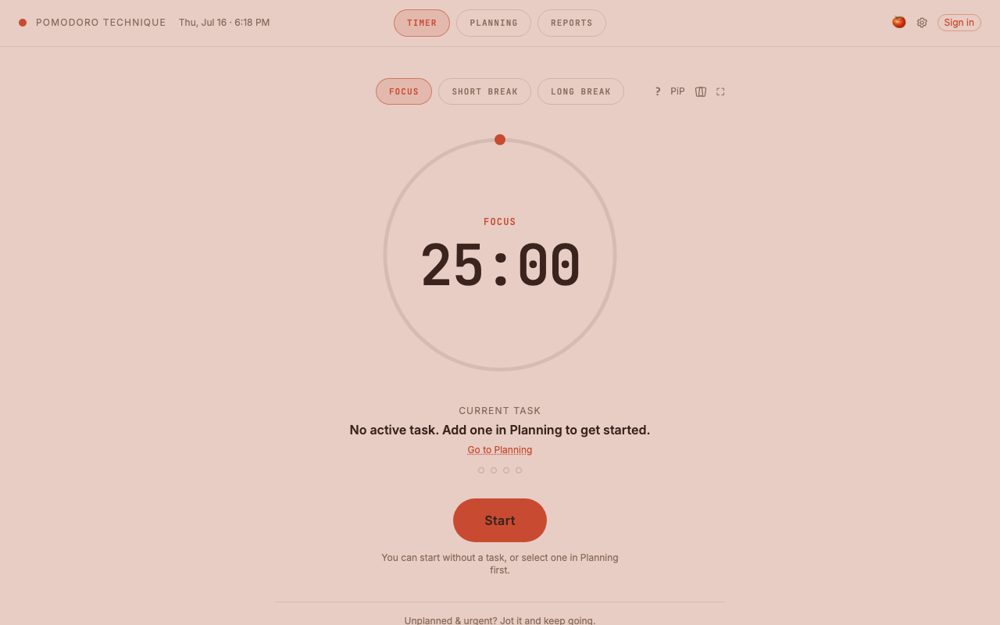
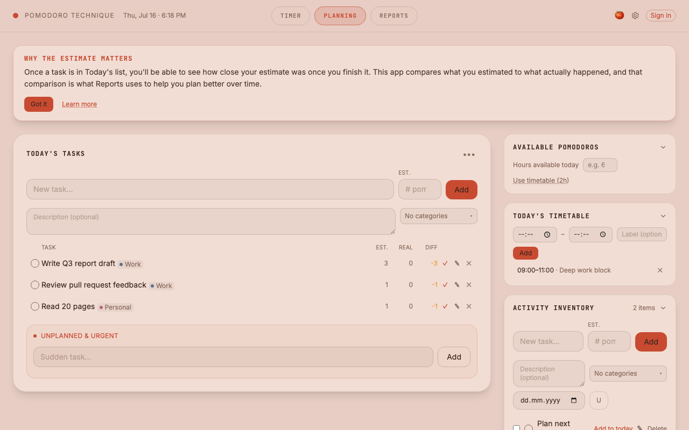
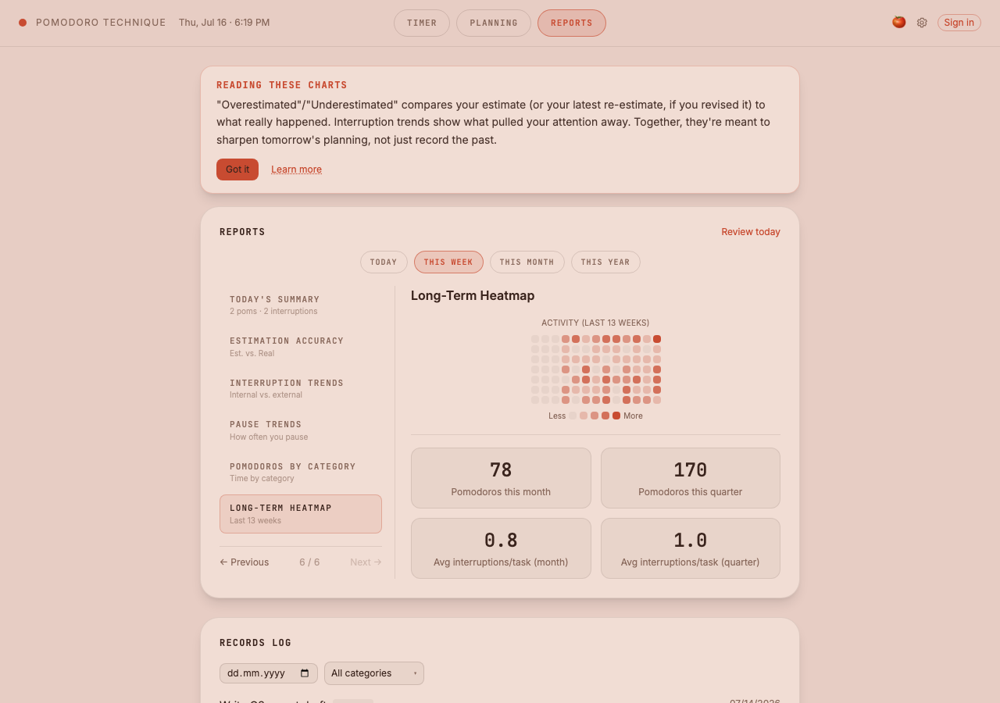
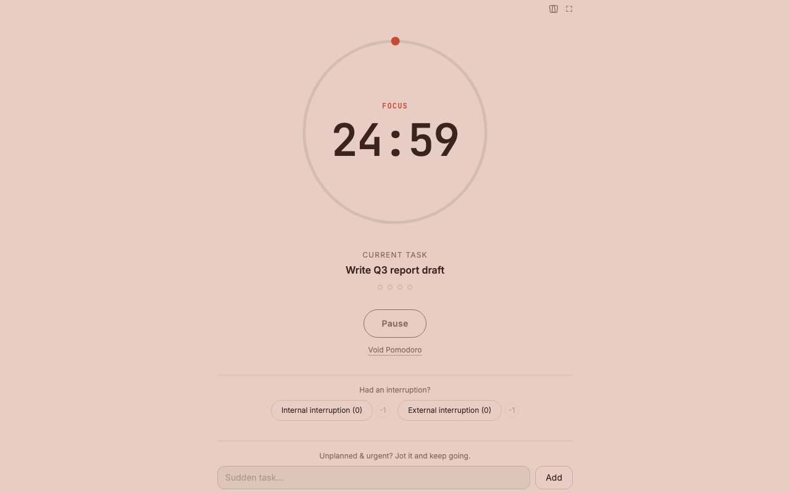
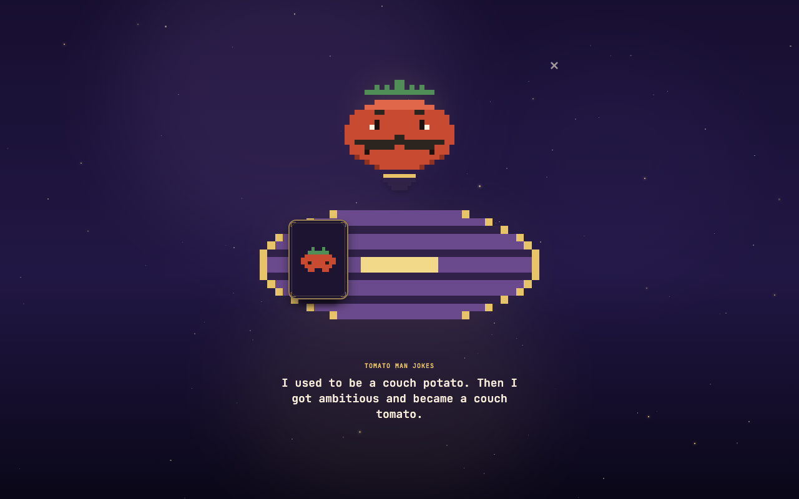

# Pomodoro Technique

[](https://github.com/alperenakturk/pomodoro-app/actions/workflows/deploy.yml)

A digital implementation of Francesco Cirillo's Pomodoro Technique — built to implement the *whole* method (planning, tracking, interruption logging, estimation, and reporting), not just a 25-minute countdown with a bell. Accounts are optional and additive: the app is fully functional offline on `localStorage` alone, and signing in transparently swaps in a Supabase-backed sync layer behind the same storage interface. It's an active solo project, currently pre-1.0, being built with an eye toward eventually anchoring a broader productivity/focus platform (see [Roadmap](#roadmap)).

**Live demo:** [alperenakturk.github.io/pomodoro-app](https://alperenakturk.github.io/pomodoro-app/)

---

## Screenshots

| Timer | Planning |
|---|---|
|  |  |

| Reports | Fullscreen Focus Mode |
|---|---|
|  |  |

**Motivation card draw:**



---

## Features

**Timer & methodology fidelity**
- Circular countdown driven by an absolute end timestamp (not a per-tick decrement), so it stays accurate across throttled or backgrounded tabs and survives a page reload
- Pause/Resume, and a separate Void flow (with an optional logged reason) that faithfully distinguishes "interrupted, discard it" from "paused, keep going" — see [`docs/methodology.md`](docs/methodology.md) for the rules this implements and the one deliberate deviation
- Fullscreen Focus Mode: auto-hiding chrome, custom uploaded backgrounds, a Picture-in-Picture mini timer, and unplanned-task capture without leaving fullscreen

**Planning & Reports**
- Planning tab: Inventory (task backlog), Today's Tasks, Available Pomodoros estimator, a daily Timetable, and multi-category tagging
- Reports tab: a six-section stepper (today's summary, estimation accuracy, interruption trends, pause trends, category breakdown, a 13-week activity heatmap) plus a searchable/filterable Records Log

**Theming & i18n**
- Dark mode plus four light palettes, or a fully Custom mode with independent colors per timer session type
- Complete Turkish/English localization, including locale-aware date/time formatting

**Auth & sync architecture**
- Google OAuth and email/password via Supabase Auth; every table is protected by row-level security scoped to the authenticated user
- Guest mode and signed-in mode share one storage interface — switching providers never touches component code (see [Architecture](#architecture-notes))
- No silent local→cloud migration on sign-in by design; a manual JSON/CSV export-import path in Settings covers that instead

**Onboarding & engagement**
- A skippable 5-step account setup wizard, shown only on a genuine first sign-up
- Contextual, event-triggered coach marks per section plus a full methodology deep-dive modal, rather than a single generic tutorial
- A motivation-card draw feature (six card categories, including a 2%-chance Rare pull) with a persisted draw history and a stats view

---

## Tech Stack

- **Frontend:** React 19, Vite 8, Tailwind CSS v4
- **Backend:** Supabase (Postgres + Auth + Storage), row-level security on every table
- **Testing/Linting:** Vitest + Testing Library (300+ tests), oxlint
- **CI/CD:** GitHub Actions → GitHub Pages, lint + test gate before every deploy

---

## Architecture Notes

A few decisions worth calling out for anyone reading the code:

- **Dual-provider storage.** `src/lib/storage.js` is the only module allowed to touch `localStorage` or the Supabase client. It delegates to a swappable `activeProvider` (`localStorageProvider` or `remoteProvider`), both implementing the same `get`/`set`/`remove` shape — so every hook and component reads/writes data identically whether the user is a guest or signed in, and the app runs with zero backend configured at all (`.env` is entirely optional).
- **RLS-secured backend.** Every Supabase table scopes reads/writes to `auth.uid()` via row-level security policies (see [`supabase/schema.sql`](supabase/schema.sql)); the anon key shipped to the client has no meaningful access without a valid session.
- **i18n as a first-class concern, not an afterthought.** All user-facing strings route through a single `t()` lookup against hand-maintained `en`/`tr` dictionaries — no hardcoded UI text — with locale-aware date formatting handled separately from string translation.

`AGENTS.md` is this repo's primary engineering-context document — hard constraints, known gotchas from real shipped bugs, and the reasoning behind non-obvious decisions all live there rather than being re-derived from scratch each session.

---

## Getting Started

```bash
git clone https://github.com/alperenakturk/pomodoro-app.git
cd pomodoro-app
npm install
npm run dev
```

The app runs fully offline in guest mode with no further setup — `localStorage` is the default backend.

### Optional: enabling accounts/sync

To enable Google/email sign-in and Supabase-backed sync locally, copy the example env file and fill in your own Supabase project's credentials:

```bash
cp .env.example .env
```

```
VITE_SUPABASE_URL=
VITE_SUPABASE_ANON_KEY=
```

Both variables are optional — if left unset, `npm run dev` still runs the full app in guest-only mode. If you do configure a project, apply [`supabase/schema.sql`](supabase/schema.sql) in the Supabase SQL Editor first (schema changes are not applied automatically).

### Other scripts

```bash
npm run build     # production build
npm run preview    # preview the production build locally
npm run lint       # oxlint
npm test           # run the test suite once
npm run test:watch # watch mode
```

---

## Roadmap

Project status, what's done, and what's next are tracked in [`progress.md`](progress.md) rather than duplicated here — it's updated as work lands and is the current source of truth for scope and priorities.
